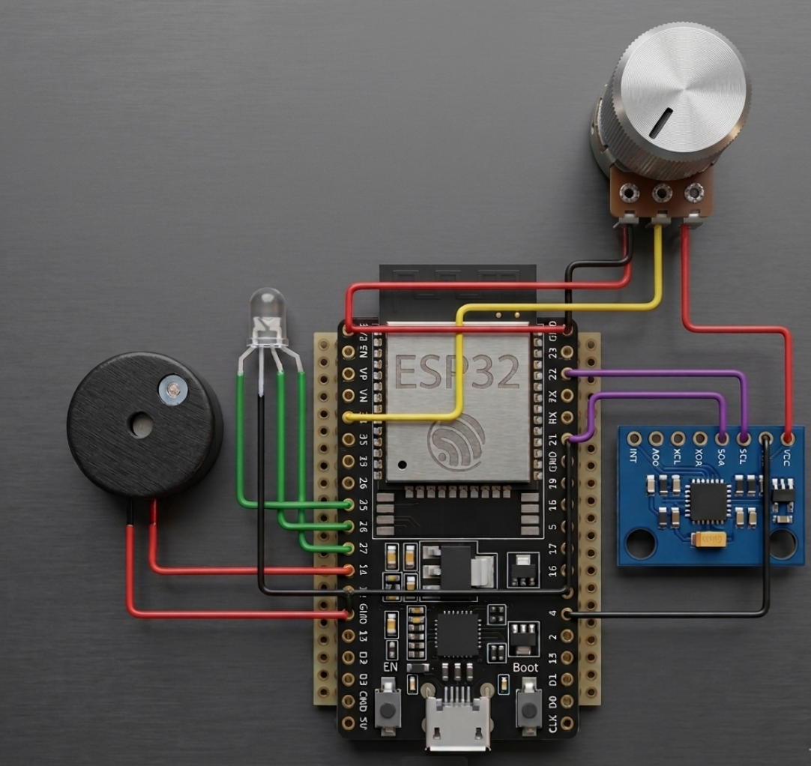
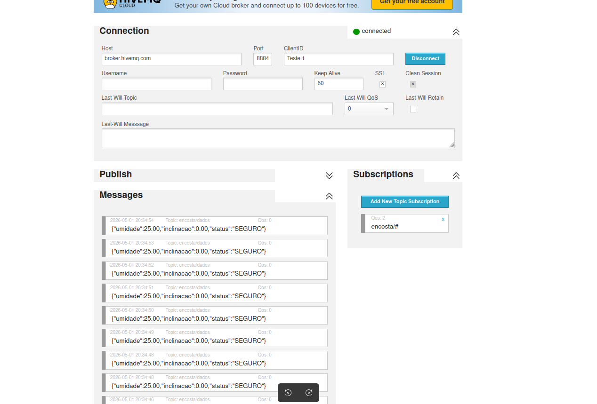

# IoT - Monitoramento de Encostas

## Autores

* Beatriz de Jesus Botechia
* Daniella Bizigatth Simplicio da Silva
* Guilherme Morais Silva

Universidade Presbiteriana Mackenzie
Disciplina: Objetos Inteligentes Conectados
2026

---

## Descrição do projeto

Sistema IoT para monitoramento de encostas utilizando ESP32 e MQTT para transmissão de dados em tempo real.
---

## Funcionamento do Sistema

O sistema realiza o monitoramento contínuo da umidade do solo e da inclinação do terreno utilizando um sensor MPU6050 e um sensor de umidade simulado por potenciômetro no ambiente Wokwi.

O ESP32 processa os dados coletados e classifica o nível de risco em três estados:

* SEGURO
* ATENCAO
* RISCO_CRITICO

Os dados são transmitidos em tempo real utilizando o protocolo MQTT para o broker HiveMQ.

Dependendo do nível de risco identificado, o sistema aciona:

* LED verde → condição segura
* LED amarelo → condição de atenção
* LED vermelho + buzzer → condição crítica
---

## Protótipo eletrônico



## Comunicação MQTT em funcionamento


---

## Hardware Utilizado

* ESP32 DevKit V1
* Sensor MPU6050
* Sensor de umidade do solo (simulado por potenciômetro no Wokwi)
* LED RGB
* Buzzer piezoelétrico
* Protoboard virtual Wokwi
---

## Tecnologias Utilizadas

* ESP32
* MQTT
* HiveMQ
* Wokwi
* MPU6050
* Arduino IDE
---

## Bibliotecas Utilizadas

* Wire.h
* MPU6050.h
* WiFi.h
* PubSubClient.h
---

## Interfaces e Protocolos de Comunicação

O projeto utiliza comunicação TCP/IP via rede Wi-Fi integrada ao ESP32.

A transmissão dos dados é realizada utilizando o protocolo MQTT no modelo publish/subscribe.

Os sensores utilizam as seguintes interfaces:

* MPU6050 → comunicação I2C
* Sensor de umidade → leitura analógica
* MQTT → comunicação TCP/IP via Wi-Fi

Os dados são publicados em formato JSON no tópico MQTT:

encosta/dados
---

## Broker MQTT

* Broker: broker.hivemq.com
* Porta: 1883
* Tópico: encosta/#
---

## Exemplo de Payload MQTT

```
{
  "umidade": 78,
  "inclinacao": 6,
  "status": "ATENCAO"
}
```
---

## Código Fonte

O código-fonte desenvolvido para o ESP32 está disponível na pasta:

src/monitoramento_encosta_mqtt.ino

O código possui comentários explicativos sobre:
* leitura dos sensores
* lógica de classificação de risco
* acionamento dos atuadores
* publicação MQTT
---

## Como Executar

1. Abrir o projeto no simulador Wokwi
2. Executar a simulação
3. Conectar ao broker HiveMQ
4. Inscrever-se no tópico:

encosta/#

5. Monitorar as mensagens MQTT em tempo real
---

[Projeto no Wokwi](https://wokwi.com/projects/457492869991865345)
---

## Vídeo-Demonstração

Vídeo em fase de produção.
